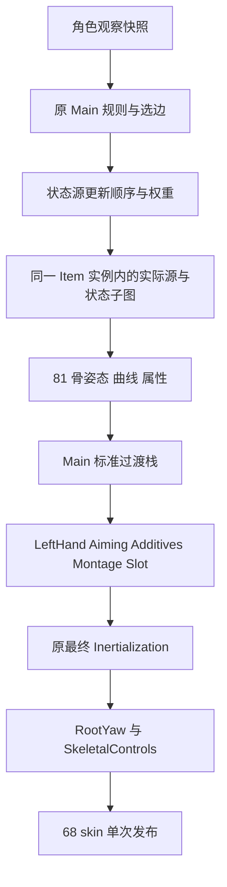

# Lyra 主状态姿态权重、源更新顺序与最终惯性化

2026-09-30，在 `.` 主目录实施；UE 源项目为 `..\GASP58`，实际引擎 UE 5.8.1，运行端 Godot 4.7.2 .NET。本批在上批原规则/选边组件之后完成 Main 状态混合组件和受控源姿态原生对照。**尚未将新状态/源宿主接入独立 Demo，未完成完整 Lyra 主图。**

## ALS 模型、Interface 与 Layer 的实施边界

继续复用当前 ALS Mannequin 模型和原 68 根蒙皮骨。重定向后的资源在动画运行端保留 69 个 raw channel 和 12 个 virtual channel，即 81 骨逻辑姿态：新增 `weapon_r` 位于右手下，新增 `VB IK_Hand_L_weaponSpace` 保留左手武器空间目标。它们参与源采样、混合和控制，最终只向模型发布原 68 skin。无需重新给模型绑定新增骨骼；已有蒙皮骨的名称、顺序和映射保持资源门禁。

Manny 的 `spine_04/05` 和不同人体比例仍须通过重定向姿态、原 mask/Profile 的目标映射及握持/Warps 验证处理。把所有动画提前压成 68 骨会丢失武器空间控制目标。资源和连续运行证据见 [逻辑骨资源](2026-09-30-lyra-logical-controls.md)及 [Layer 接入](2026-09-30-lyra-logical-layers.md)；本批未重新生成或覆盖这些资源。

Animation Interface 继续使用当前强类型 `ILyraItemAnimationLayers`、14 个 `LyraLayerHook` 和只读编译合同。签名必须保留三个输入姿态参数及 Aiming 的原 double 参数；当前示例的 Aiming float 边界尚需在完整宿主中迁移。接口定义姿态调用约定，实际求值需要对应实例、源播放器、缓存和图上下文。

实际 `ItemAnimLayers` Group 的 14 个入口共享同一角色内的 provider 实例。当前 `LyraItemLayerInstance` 已共同持有已接姿态组件；同类重绑保留实例与历史，换类构造新实例，原生八步绑定已验证。**共享实例不意味着所有入口共用一个播放时间。** Start/Cycle/Stop/Pivot/空中以及 Idle/Pivot 子状态需要自己的 source occurrence、相关性和更新上下文，再参加原共享 Sync；各层不能独立推进整套角色时钟或直接写 Skeleton3D。

主图接入顺序明确为：



非 Idle 状态中的 HipFire/Lean 等应在该状态的 linked pose 内求值，再进入 Main 混合；当前示例的全局 HipFire 分支还不是完整原图拓扑。Linked 源切换、Idle/Pivot 的惯性请求也必须向同一最终节点转发。主状态机自己的四条惯性边是本批关闭的范围。

## 新组件与原生执行

`LyraLocomotionPoseState` 接收已校验的 terminal edge、conduit path、原 float delta 与 CrossfadeTimeAdjustment，复用 `AlsTransitionStack` 的 HermiteCubic 权重和 lifetime。它拥有完整候选状态及最终惯性历史，支持重置、拷贝、取消后恢复。

标准过渡按原顺序叠加，目标仍有权重时按原 inverse Hermite 近似缩短 duration；自动剩余时间调整先从原 duration 扣除。首帧切换状态后丢弃标准混合记录。骨骼 quaternion 在所有标准边累计完后统一 normalize；中间结果不逐边 normalize。曲线保留 present/absent，按原 Override/Accumulate 顺序和 anim relevance 门槛处理。

源更新计划使用**清理完成过渡之前**的整栈权重，按旧→新 transition 遍历，重复 state 只更新一次。旧状态以 inactive context 更新；当前状态 active。实际原生轨迹中有 30 个源更新在最终状态权重已经为零时仍带非零更新权重。不能根据最终 pose 权重省掉这些更新，否则会改变源时钟、Sync 和 Notify。

四条 Main 惯性边立刻切目标 pose，发送原 duration 0.2 秒；不会把它改成标准 0.2 秒 crossfade。原请求和 source 的 `FAnimInertializationSyncScope` 标志分别保留。`EvaluateMachine` 只求值状态姿态，不推进源时间；`EvaluateFinal` 显式接收上身/Additives/Slot 之后的姿态，每个准备帧一次，因此未来宿主可以保留原最终节点位置。

外部 exporter 新增 `ReadLocomotionBlendTrace`，真实注册临时 GamePreview 世界、Actor、Manny 组件和当前 Main AnimInstance。实际 `IAnimClassInterface` 提供原 baked machine；`TransitionToState`、`Update_AnyThread`、`Evaluate_AnyThread` 均执行安装版原引擎实现。复制真实 Main 最终惯性节点默认配置，将 driver 置于其 request scope 内；实际原生请求由该节点接收并求值。

该 composition oracle 明确使用受控 terminal edge 和每个真实状态的两份采样姿态模板。模板来自现有完整 ALS raw81 bank，包含 Pistol Cycle 和 Unarmed 地面/空中；曲线使用 Both/Incoming/Outgoing 稀疏受控值。实际 StateResult 的子 pose 输入被替换，后续根不执行原 node callback。它证明原过渡合成、更新上下文和最终惯性实现，**不证明 original linked graph、source clock、Sync、Notify、attribute、Montage、Warping 或游戏输入整链。**

## 精度修复与验证

首轮 840 帧的状态/time、active stack 的 duration/elapsed/alpha、所有 state 权重、源更新顺序/权重/active/sync-scope、惯性请求和曲线均与原生相同。最终 quaternion 有 285 个分量比较超出固定 2e-7 门槛，最大 1.2252766426190664e-6；失败日志保留。

定位至 `FQuat<double>::GetTwistAngle` 调用 `FMath::UnwindRadians<double>`：原 `UE_PI/UE_TWO_PI` 是 float 宏，在 double 运算中提升；此前两种 precise 惯性路径使用了完整 double π。修正 full pose 与 precise quaternion 的原角度归一化边界，未改 UE、未重导 oracle、未提高门槛。

最终结果：

```text
LYRA_LOCOMOTION_POSE_MEASURED hz=30,60,120 frames=840 bones=81 states=10
sourceUpdates=1561 depth=3 inertiaRequests=18 precleanupUpdates=30
maxP=0 maxQ=2.220446049250313E-16 maxS=0
finalP=0 finalQ=2.220446049250313E-16 finalS=0 curves=0 retry=True
scope=controlledSourceComposition
LYRA_LOCOMOTION_POSE_OK
```

每帧先完整求值候选和惯性输出，模拟取消，再从 committed 历史拷贝重试，最终输出逐值相同。三频率各四秒均覆盖十个真实状态，最长三条重叠过渡；包含首帧、weighted target 重入、标准→惯性打断、自动时间调整、两段 conduit、零 duration、组件旋转和 1000cm 瞬移。

共享修复回归：Core 惯性化/TransitionStack 42 项、Standing 原生独立/共享六组全部通过，原比较阈值不变；原 Lyra 576/1536 rule、480 selection 和绑定八步/14 hook 回归通过。独立 Lyra Demo 60Hz 实际换层回归记录于 `locomotion-pose-demo-regression-60-final.log`，其生产宿主仍为既有实现。首次仅限制 render frame 的运行提前退出、缺少成功标志，不计通过；改为固定 render Hz 后跑足全部物理轨迹，首份日志保留。

原生 probe 保存资产数零，导出前后 485 个源包 SHA 相同。新增 `locomotion_blend_native.json` 为 ignored 不可变资源，绑定 requests、runtime graph、calibration、catalog 字节哈希；requests 在 `artifacts/lyra-analysis/locomotion-blend-requests.json`。旧 JSON 未格式化，不能以仅代码检出作为可运行交付。

原生编译第一次因 protected accessor 用法失败，修为派生访问器后通过；Godot 首次两个 API 类型/随后匿名类型 nullability 编译错误已修复。`locomotion-blend-native-build-first.log`、`locomotion-pose-build-first.log`、`locomotion-pose-build-corrected.log`、`locomotion-pose-smoke-first.log`、`locomotion-pose-smoke-diagnostics.log` 保留，最终日志采用独立文件。

UE 导出退出 0、Error occurrence 为零；20 个 Warning occurrence 包含重复汇总、旧 GameplayTag/启动/Editor unavailable 警告，本批未修这些源项目问题。没有新增 GPU 渲染、完整人工矩阵、十分钟或性能验收。

最终 Debug/Release Optimize 均零错误/零警告；Godot 最终验证日志无 ERROR/WARNING。汇总位于 `artifacts/lyra-analysis/locomotion-pose-final-verification.json`；运行 `python tools/verify_lyra_locomotion_pose.py` 独立复核 oracle 依赖、485 包/11 依赖 JSON/234 raw clip、测试结果和成功标志。

## 复跑与下一步

```powershell
# 构建 Godot 后生成不可变输入；存在时校验字节相同。
.\Godot_v4.7.2-stable_mono_win64\Godot_v4.7.2-stable_mono_win64_console.exe `
  --headless --path . scenes/tests/lyra_locomotion_pose_smoke.tscn -- --lyra-blend-requests
.\scripts\build-gasp58-exporter.ps1 -EngineRoot '../UE_5.8' `
  -UnrealProject '..\GASP58\GASP58.uproject' -ExternalOnly
.\scripts\export-lyra-locomotion-blend.ps1 -EngineRoot '../UE_5.8' `
  -UnrealProject '..\GASP58\GASP58.uproject'
.\Godot_v4.7.2-stable_mono_win64\Godot_v4.7.2-stable_mono_win64_console.exe `
  --headless --path . scenes/tests/lyra_locomotion_pose_smoke.tscn
```

下一步为实际 linked owner 的独立 source 更新/相关性和缓存→共同 Sync→最相关源/marker 反馈给原选边→每个状态内姿态求值→本批 Main 混合→原外层与统一最终惯性→Demo。同步补齐源曲线/flags/attributes、真实 Notify 和 Linked 惯性请求，适配 Pivot FastFeet 逐骨 duration；之后才做完整连续 UE 原生对照与 Warps/足部/握持验收。Lyra 支线及 ALS R2–R7 保持开放。
