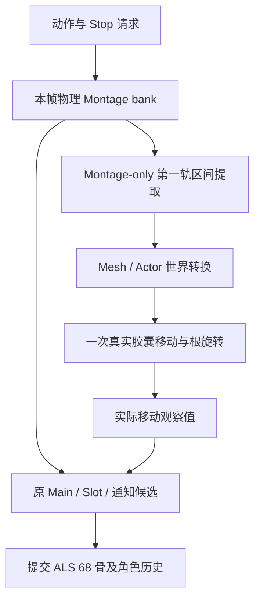

# Lyra Montage 根运动与真实胶囊移动

最新四原 Warp 模板已在显式挂载的真实角色中执行，使用实际 root context、ALS component 与胶囊 feet，目标变化/销毁及碰撞/同帧 retry 通过两构建三Hz门禁，见 [Warp物理验证](2026-10-02-lyra-motion-warping-physics.md)。默认已读 Shooter 配置不补组件/Align，原 GA 激活与完整 Main 等仍待；下方新组件未接生产胶囊为此前阶段。

后续 Align/SkewWarp 的指定原配置组件已通过记录 context / adapter 输入下的连续原生对照，见 [最新组件验证](2026-10-02-lyra-motion-warping-component.md)。新组件仍未进入本文的生产胶囊路径，以下 MotionWarping 待接与整链范围保持开放。

2026-10-02。直接在主目录实施，保留用户及此前未提交修改。人物继续使用 ALS 68 skin / 81 logical，14 个 typed Layer 入口沿用角色内共享的 `ItemAnimLayers` 实例。本批接通 Montage-only 根运动提取与普通角色的真实 Godot 物理更新；原 MotionWarping、完整 Main 连续 native 和整个 Lyra 移植目标保持开放。按用户要求不展开 UE 5.8/5.9 差异。

## 原资产和运行顺序

原 Main CDO 的 `RootMotionMode` 实际为 `RootMotionFromMontagesOnly`（3）。Provider 图里的 RootMotionDelta 属性用于姿态 Warping，不能直接用作胶囊位移。物理提取读取当前选中的 Montage 实例、第一条 Slot track 和实际 Advance 区间，忽略图权重与 Slot 混合权重。

45 个原 Montage 中，只有四个 MW Emote 启用根运动：MF FingerGuns，以及 MM Pistol/Rifle/Shotgun Reload Emote。两个独立 UE 进程分别执行 53 条轨迹、8,564 帧，5,569 帧有根运动提取资格，但所有原动画提取出的局部变换都为 identity。这里的“有根运动”指有效提取区间，不代表存在非零位移。原 Emote 向目标移动依赖 MotionWarping，不能用这些零位移参考宣称非零原动作已还原。

新增只读 Pawn CDO 采集，两进程实际退出 0 且结构相同。原 Shooter Pawn 的 `useControllerRotationYaw=true`，CMC 的 `allowPhysicsRotationDuringAnimRootMotion=false`。PlayerController 调用 Pawn FaceRotation 与 CMC PhysicsRotation 是两个阶段；普通场景仍在转换根运动前更新控制器 yaw，根旋转在胶囊移动后应用。

参考模块实际调用原 Montage UpdateWeight/Advance/Consume、真实 Mesh ConvertLocalRootMotionToWorld 及 CMC Calc/Constrain。覆盖 30/60/120Hz、播放/重播、反向、Stop、非根 Montage 替换、零 delta、不同 actor/mesh 旋转/偏移及 0.7/1.4 缩放；第二次 Consume 均为空。它使用临时真实对象和手动排序，不是完整 UE 世界物理 tick 或完整 Main oracle。

## 生产接入和事务边界

普通玩家和 `LyraSceneCharacter` 先收集动作请求，准备同一物理 Montage bank 的本帧 Advance，再提取根运动并执行一次真实 `MoveAndSlide`，最后由实际移动结果构造 Main 观察值。Main、Slot、通知队列复用该 bank 和区间，不增加另一套时间。无根运动时仍执行正常胶囊速度；下落时保持实际垂直速度。完整 mesh/actor 关系参与世界转换，根旋转在位移后作用于 upright capsule。

原 Stop 在 Advance 前清除后续根运动所有权；自动 fade 开始的本帧仍可提取已经遍历的区间。新增 `AlsMontageStopRequest` 使用 ActionDefinitionId 查询实际 MontageId，测试用 17→71 的不同编号防止偶然相等掩盖错误。动作/Stop 请求、时间和实例序号均随动画候选提交或丢弃。

物理发布有明确边界：移动前 Prepare/Cancel 无场景副作用；真实 MoveAndSlide 后，动画取消不能撤回已发生的碰撞移动。同一物理帧的 Main 重试重新准备相同 Montage 区间并复用移动凭据，拒绝再次移动。凭据绑定角色、代际、物理 tick、空间、actor/component 快照，拒绝迟到、跨角色、重放、变换变化和移动期间换类。六角色共用一份不可变压缩 root decoder，各自保留 bank、物理 motor 与历史；销毁单角色不会释放其他角色的共享资源。

## 最终验证

| 边界 | 结果 |
| --- | --- |
| 原 Montage 提取 | 两 UE 进程各 53 轨迹 / 8,564 帧 / 5,569 有效提取帧，退出 0，结构相同；Godot 两构建逐帧取消重试通过 |
| 原生值门槛 | local/world position L2 ≤ 1e-8cm、quaternion L2 ≤ 1e-10、scale L2 ≤ 1e-12；constrained velocity L2 ≤ 1e-6cm/s；原 local 全为 identity，非零原 motion 未覆盖 |
| 原 Pawn 策略 | 两独立 UE CDO 采集退出 0，控制器 yaw 开启、CMC 根运动期间 PhysicsRotation 关闭 |
| 六角色真实物理 | 每构建 30/60/120Hz 共 10,080 次胶囊移动、同数移动前取消重试和移动后动画重试；18 次 Stop、36 次换类；每帧一次移动 |
| 提取资格 / 正常移动 | 30Hz 930 / 510，60Hz 1,856 / 1,024，120Hz 3,704 / 2,056；各频率都有两类路径 |
| 非零碰撞边界 | 五个人工输入场景：开放位移、阻挡墙、沿墙滑动、下落保持垂直速度、移动后 yaw；真实 Jolt 执行通过，明确不作为原动作非零位移对照 |
| 生命周期 | 移动前 Cancel、跨角色、快照变化、重放、移动后重试、换类拒绝及下一物理 tick 迟到拒绝通过；迟到凭据移动数 0 |
| Core Release | Montage 相关 188 项通过，0 失败/跳过，含 ActionDefinitionId 与 MontageId 不同的 Stop 取消重试门禁 |
| 旧路径回归 | 原 Montage 15,870 帧采样 / 298 root 检查、武器 5,040 帧 / 30,261 骨和真实六角色 / 回调生命周期通过 |
| 普通十角色 | 每构建 4,800 次胶囊移动及人物发布，root 接管数 0；两构建报告逐值相同，去掉新增移动诊断后与上一批冻结报告完全相同 |
| 构建和运行 | Debug 与实际 ExportRelease Optimize 均 0 警告/错误，各七进程退出 0，无 Godot ERROR/WARNING；六个 Debug DLL/PDB SHA 恢复相同 |
| GPU | OpenGL 60Hz，30/90/270 帧三张 1280×720 图均已查看；退出 0、stderr 空。覆盖基本人物/武器/Emote 姿态，不作为 Align 位移或近景握持验收 |
| 资产保护 | 843 个旧 JSON、706 个原包、Pawn 原包、项目/Config 哈希保持；actor CDO 导出又保护此前 846 个 JSON；0 资产保存，临时 UE 插件移回 artifacts |

运行证据位于 `artifacts/lyra-analysis/root-movement-{debug,optimize}-gate-final6.log`，汇总为 `root-movement-verification.json`。Core 使用 `root-movement-core-final5.trx`：此后 Core 无代码修改，final6 仅修正实际 Pawn 策略的 Godot 接入。`scripts/verify-lyra-root-movement.ps1` 明确记录实际加载的程序集 SHA，优化构建验证后恢复 Debug 文件；重复验证需指定新 RunTag 并生成相应构建日志，不能覆盖既有证据。

新增四个被 Git 忽略的 `assets/generated/lyra_als/root_movement_v1_*.json` 是本机运行资源，不能只交付代码检出。原 JSON 字节及关联 SHA 未重新格式化。初次 C++ JSON Serialize 类型错误、插件未启用导致 Python 类缺失，以及早期 Godot 编译错误均保留日志；后续修正和最终通过不抹除这些失败。

## 下一边界

原 MotionWarpingComponent 在 local→world 转换前直接扫描当前 Montage 的窗口，以 PreviousPosition 是否进入窗口决定 modifier 激活，再依序处理 active modifier。它不依赖普通 NotifyQueue 才开始运行。原资源使用 `RootMotionModifier_SkewWarp`、`WarpTargetName=Align`；零 authored translation 分支以原 ActualStartTime/位置到目标生成位移，旋转另行处理。

下一步须采集原目标来源、modifier 配置/状态、窗口与生命周期，并以实际原组件连续轨迹验证 Align/SkewWarp 后再接生产 motor。当前 `motionWarpingConsumer=false` 保持真实状态。完整 UE Movement/Chaos 与 Godot/Jolt 物理等价、整个 Main 连续 native、完整 NotifyState/命名事件、Shotgun/Feminine 完整 Main、通用 Linked 多 Group/self-layer/Unlink、复杂地形/近景握持/材质和性能仍开放。音频、道具物理及头颈专项继续暂缓。未新增 Emote UI 或完整 GAS 技能；普通左键 Fire、R Reload、Q 换装保持此前已验证行为。
