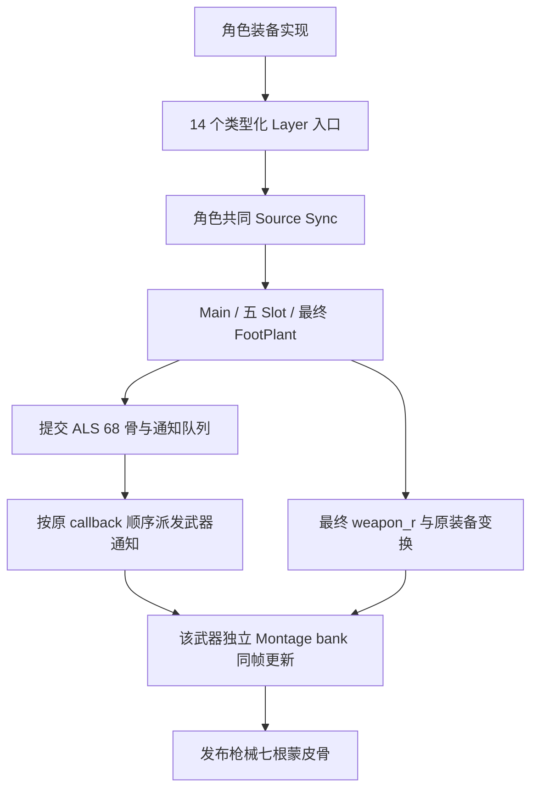

# ALS 人物的 Lyra 武器通知、挂接与装备生命周期

2026-10-02。直接在主目录实施，保留此前和用户未提交修改。普通 Lyra Pistol/Rifle 已接原武器通知、独立武器动画更新、最终 `weapon_r` 挂接及 Fire/Reload 动画。整个 Lyra 移植目标保持开放。按用户要求不展开 UE 5.8/5.9 差异。

## 人物与 Interface / Layer

人物继续使用原 ALS 模型、68 根蒙皮骨骼及其绑定。动画资源离线从 Manny 重定向至 ALS，运行使用 69 个 raw 通道及 81 个 logical 通道：额外武器和虚拟骨参与动画计算，最终只向原 68 根蒙皮骨写入。武器独立保留原七/八骨逻辑动画和七骨物理网格，不能将枪械动画并入人物骨架。

当前 Lyra Animation Layer Interface 的 14 个入口使用不可变类型合同，包含姿态输入、参数类型、调用节点和命名组。每角色的 `ItemAnimLayers` 组共享一个装备实现实例；Main 持有宏观状态和连续历史。同类重绑复用实例，换类创建新实例并撤销旧代际访问资格。Layer Group 控制实例共享，Sync Group 控制源时间同步，骨遮罩控制混合权重。普通 Actor/Component 业务接口采用 typed 接收者；带 Pose 输入输出的接口进入动画执行合同。通用多 Group、self-layer、Unlink 和部分覆盖仍须单独验证，当前实现不宣称任意 UE 接口兼容。

## 原生依据与本次接入

新增独立可选 `LyraWeaponEquipmentOracle` 模块，执行原 EquipmentManager、原武器 Actor、原 `AN_PlayWeaponMontage` BP 对象及原武器动画图。观察到三种枪的 SkeletalMesh 都是 Actor root；挂到人物 Mesh 后有一条实际 parent tick prerequisite，人物/武器均为 PrePhysics。保留完整精度的 WID attach、实际正规化 Actor relative、Mesh relative 和 socket/Actor/Mesh world 变换。两个 UE 进程各实际退出 0，结构内容相同，资产保存数 0。参考程序按观察到的依赖手动执行通知后武器动画；这不是完整 UE 世界 tick 或整个 Main 连续 oracle。

`AlsDynamicMontageRuntime.BeginWithActionRequests` 在候选历史中先接受动作再执行本次 Advance。请求失败或取消不提交时间、实例或序号，空请求沿用旧路径，不增加独立通知时钟。角色通知消费者按已提交 callback 顺序，每次重新解析当前首装备的首 Actor，缺少动画实例时不退到后续装备；保留原 BP 返回 false 和未连接 MontageFollower 的无 follow 行为。手枪 Reload 使用原 1.5 倍速。

角色统一预校验后提交 Main、队列和 ALS 骨架，再派发 Gameplay/Context/Weapon 接收者，最后推进各武器自己的 bank。换类先准备新装备，再重绑并退役旧装备。同类复用；信号内销毁动画宿主、QueueFree 角色或重绑会停止旧实例后续派发和武器 tick。Prepare 期间不修改场景骨架或武器变换，取消可重试。

武器模型使用最终人物 logical pose 的 `weapon_r`、原装备相对变换、Godot 世界轴转换和 FBX 骨架基底，独立写入七根枪械骨。GPU 世界检查按矩阵相乘计算期望；非均匀缩放下不能用丢弃剪切的 FTransform TRS 合成代替实际渲染矩阵。原生姿态比较的原门槛未改变，Godot float 场景边界另作明确精度检查。

## 最终验证

| 边界 | 结果 |
| --- | --- |
| 原武器通知后同帧动画 | 三枪 × 30/60/120Hz，5,040 帧、4,323 姿态、30,261 骨；position/quaternion/scale 差均 0，时间与权重逐位同 |
| 原实际通知 / 挂接 | 72 次原 Notify；36 个 attachment，位置/scale 差 0，正规化 quaternion 最大差 1.6184142622847344e-16 |
| typed 原行为 | 36 案例，18 播放/18 缺失；取消无副作用、逐例重试、每 callback 新查找、首装备不回退、旧身份拒绝通过 |
| 真实六角色三频率 | 每构建 10,080 角色帧及同数取消重试，6,720 武器发布、47,040 世界骨检查、48 播放、36 换类及 18 同类复用 |
| 场景 float 世界边界 | 最大位置差 5.364418029785156e-7m、quaternion 差 2.443972150513042e-7；含模型 0.7/1.4 缩放，门槛分别 1e-4m / 1e-6 |
| 信号生命周期 | 每频率三个实际 ReloadDone 场景：Dispose、QueueFree、换类；重入 Prepare 拒绝，旧武器不再 tick，新实例同帧更新 |
| 普通十角色入口 | 每构建 4,800 人物发布、3,168 武器发布、21 次武器通知、0 缺失；Debug/Optimize 完整报告相同 |
| Core Release | Montage 相关 187 项通过，0 失败/跳过；含新增动作先于 tick 的事务门禁 |
| 旧路径回归 | 武器 bank 8,820 帧/52,920 骨原生零差及 540 模型发布；Gameplay 3,735 案例、Context 4,121 案例/4,139 窗口帧通过 |
| 构建与运行 | Debug 和实际 ExportRelease Optimize 各构建 0 错误/警告，各七进程全部退出 0，无 Godot ERROR/WARNING；六个 Debug DLL/PDB SHA 恢复相同 |
| 实际 GPU | OpenGL 60Hz 渲染退出 0，stderr 空；30/90/270 帧三张 1280×720 图均已查看，基本人物姿态和枪械挂接可见 |
| 原资产保护 | 840 个旧 JSON、706 个原包、项目描述和 Config 哈希保持；临时 UE 插件移回 artifacts |

GPU 三图使用远景观察，未完成近景握持、手指接触、穿插或 UE 材质一致性验收。UE 原有插件/tag 警告保留，不能称 UE 无警告。两套 Godot 矩阵和原生进程的检查由 `tools/verify_lyra_weapon_equipment.py` 汇总，实际已通过，结果在 `artifacts/lyra-analysis/weapon-equipment-verification.json`。

证据目录为 `artifacts/lyra-analysis/`：最终矩阵 `weapon-equipment-{debug,optimize}-gate-final2.log`、普通报告 `weapon-equipment-{debug,optimize}-main-final2.json`、两次 `weapon-equipment-ue-{first,repeat}.log`、`weapon-equipment-core.trx` 与 `weapon-equipment-render-{30,90,270}.png`。新资源是 ignored 的 `assets/generated/lyra_als/` 下 `weapon_equipment_v1_{requests,policy,native}.json`；交付运行必须保留本地生成资产。

保留失败证据：首可选模块 package 构建因 TObjectPtr 指针推导失败，修 `.Get()` 后另存 `package-fixed`；三个早期 world 检查日志保留。初期期望错误混用了局部近似和丢弃剪切的 TRS 世界合成，最终改为实际 GPU 矩阵期望后通过，未改变原生姿态算法或严格门槛。最终构建与矩阵使用 `final2` 标签，脚本拒绝覆盖已有证据；新运行需显式给新 RunTag/LogName。

## 普通操作与开放范围

以 `--locomotion=lyra --lyra-profile=pistol` 或 `rifle` 打开普通入口，左键开火动画、R 换弹动画，Q 在 Unarmed/Pistol/Rifle 间切换。Shotgun 已有原独立武器图资源，完整人物 Main 尚未接入。

本批只关闭本套资源的武器 Notify、挂接、装备生命周期及普通 Fire/Reload 动画边界。完整 Main 连续 native、完整 NotifyState/命名事件/MotionWarping dispatch、RootMotion 生产碰撞、Shotgun/Feminine 完整 Main、通用 Linked 多组语义、近景握持/材质/复杂地形/性能仍开放。未实现完整 GAS、弹药、伤害、网络或自动连发。音频、道具物理及头颈专项继续按既有要求暂缓。
