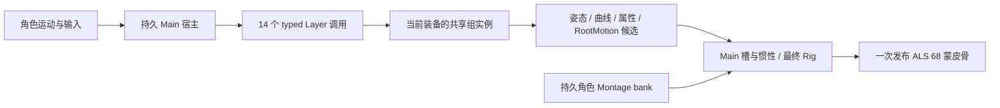

# ALS 人物上的 Lyra 完整 Main 与动作中换层

本批直接在主目录实施，沿用 ALS 68 skin / 69 raw / 81 logical 和十四入口共同 `ItemAnimLayers` 实例。原 Main、真实 Linked Layer 更换、五 Slot/Montage、惯性和最终 FootPlant 的指定联合连续对照已通过，最终矩阵及文件审计成功。整个移植目标保持 active。

## 人物与骨架

已重新核对 `logical_controls/calibration.json`：源为 `/Game/Characters/Heroes/Mannequin/Meshes/SKM_Manny.SKM_Manny`，目标为 `/Game/AdvancedLocomotionV4/CharacterAssets/MannequinSkeleton/Meshes/Mannequin.Mannequin`。继续使用现有 ALS 模型、材质、蒙皮权重和 68 根物理骨；离线 IK Retargeter 转换 Lyra 动画。

raw69 在原 skin68 后添加父为 `hand_r` 的 `weapon_r`；logical81 再加入原 ALS 十一个虚拟骨和武器空间左手虚拟骨。新增通道用于动画、武器和 IK 计算，最终统一映射发布到原 skin68，不重做网格蒙皮，也不让 Layer 独立写模型。

ALS 缺少 Manny 的 `spine_04/05` 等骨，Warp 脊柱定义需映射并去重，BlendMask/BlendProfile 按目标骨名适配。最终 Rig 使用显式 ALS compact reference 和 Construction，腿长由目标参考重算为约 42.57/40.20 cm。仅重定向动作不会自动替换 Manny 原 45.75/41.71 cm 的 Rig 配置。近景握持和复杂地形仍需单独验收。

资源合同保留源/目标身份与哈希、骨层级和参考姿态、曲线存在性/flags、Distance、Sync Marker、Notify、additive 基底、typed attributes 和 RootMotion。FBX 可用于模型和动作交换，完整执行还依赖旁路元数据。

## Interface / Layer 的实现

Animation Layer Interface 是姿态函数合同。Linked Layer 是 Main 原调用位置执行的子图，可包含状态机、播放器、additive、骨混合和 IK。[Epic 官方文档](https://dev.epicgames.com/documentation/en-us/unreal-engine/animation-blueprint-linking-in-unreal-engine)明确同一非默认 Group 共享 AnimInstance，并支持 InputPose 与属性参数；本机 UE5.8 实现也已核对。按用户要求忽略5.8/5.9差异。

| UE 语义 | Godot 当前实现 |
| --- | --- |
| Animation Layer Interface | `LyraLinkedLayerContracts`：入口、组、输入姿态、属性类型和原调用节点的不可变合同 |
| Main AnimInstance | `LyraMainPoseHost`：角色观察、宏状态机、RootYaw、调用顺序、共同 Sync 和最终反馈 |
| 装备 Linked AnimInstance | `LyraItemLayerGraphInstance`：同角色同组的播放器、子机器、缓存与回调历史 |
| Linked Layer 调用 | `LyraLayerInvocation`：hook/MainNode/instance/epoch 身份，输入姿态与候选输出视图 |
| BlendMask / additive | 目标骨映射后的姿态算子，保持原基底、空间和求值顺序 |
| Sync Group | 角色源作用域中的选主、marker 与时间同步 |
| Notify / Montage | 角色统一队列与五 Slot bank，提交/取消遵循同一候选身份 |
| 模型发布 | 完整 logical81 求值成功后只发布一次 skin68 |

原十四入口全部属于 `ItemAnimLayers`：十个移动状态入口、FullBodyAdditives，以及 Aiming/SkeletalControls/LeftHand。后三者分别接收 `PreAimPose`、`InPose`、`InputPose`；Aiming 的 AimYaw/AimPitch 为 double。Layer Group、Sync Group 与骨遮罩分别决定实例共享、源时钟同步和骨权重，不能混用。



若“Animation Interface”还包括普通 Blueprint Interface 的角色查询或 Notify 回调，应分别映射为 typed 角色服务和事件消费者。它们提供运动/装备数据或接收已提交事件；姿态函数仍通过 Layer 合同执行，不能由回调临时创建另一套动画时钟。

同类重绑保留组实例和 epoch；换类只创建新的组实例，Main/角色/Montage/Rig 持续存在。旧实例退休，旧调用和跨角色调用拒绝。新类初始化、隐藏入口首次访问及惯性请求按原节点生命周期执行；候选未完成时拒绝重绑。当前验证限定原单组拓扑；多 Group、无组按调用节点独立实例、self-layer、Unlink、部分覆盖和持久实例配置仍开放。

## 原生轨迹与修正

外部探针实际调用 Main 的 `LinkAnimClassLayers`，保留原 Main 对象；每帧核对十四节点指向一个真实活跃 Linked 实例。更换时保留已冻结的物理 Montage 数据，旧 tap/root 强引用及恢复路径防止过期指针。新 Linked 对象执行初始化与目标骨缓存/遮罩刷新，没有重置 Main。每次操作前后 Main 字段和冻结 Montage 输出精确相同。

三初始 Provider 为 Unarmed/Pistol/Rifle，各十二秒；各轨迹十四条原动作命令沿初始 Provider 固定选择，穿过后续动画类更换。因此这是动作与 Layer 执行对照，不是装备 GameplayAbility 自动选动作的验收。资源库为300序列/45原 Montage，原轨道、区段、Notify 和目标 BlendProfile 保留。每种 Hz 共24次换类、24次同类绑定，其中21次换类时存在冻结 Montage，6次发生在移动图隐藏时。

补齐原 Main 状态机 Update 对 Linked 实例身份的观察：只在真实访问时消费 epoch 变化，隐藏帧延期、同类绑定不制造变化、取消重试保留候选观察。旧直接机器组件 oracle 不执行原节点 OnUpdate，因此其入口显式保持原组件范围；完整 Main 默认执行真实回调。

另修正共用 `AlsComponentPose.BlendWith` 的位置/缩放插值为两项加权贡献，与安装版 `FTransform::BlendWith` / `VectorLerp` 一致。原差值形式在 Rifle 第472帧留下一个 pelvis Z ULP，最终近伸直腿 IK 放大为 quaternion 差 `7.45058e-9`。独立输入反事实确认是上游输入舍入；没有修改 IK 算法或放宽原门槛。

扩大回归发现旧独立 Orientation/Stride 在 Unarmed/60Hz 第248帧失败，旧六程序集重放产生相同根骨旋转差 `0.02065841997227029`，证明它已在上一动作里程碑存在。安装版 SkeletalControlBase 与原 native probe 都在 alpha 过滤时跳过 UpdateInternal；宿主此前仍推进 counter，丢失恢复有效 alpha 时的 gap reset。已在手动与 compiled binding 两入口补实际 alpha 门控，保持 update-only 与取消历史。修后独立 Orientation/Stride 均通过3528姿态/3780物理帧，原门槛不变。

Main 回调修正改变了实际源通知窗口；新增 versioned `montage_notify_queue_v2_*`，保留 v1 原字节。真实原 HandleEvents/PostUpdate 共15轨迹33235帧成功退出0，Godot 生产队列按 v2 对照。该队列探针明确不代表原整图 Notify dispatch 或原 Montage Advance 的完整联合验收。

## 验证记录

最终矩阵与资产审计已通过，结果为 `artifacts/lyra-analysis/whole-main-rebind-final-integrity.json`。脚本 `tools/verify_lyra_whole_main_rebind.py` 已核对当前 Debug/ExportRelease 程序集 SHA、实际日志、旧输入、恢复备份及保留失败证据；已有报告不得覆盖。记录保持 `comparisonPassed=true / completeAcceptance=false / goalComplete=false`。

| Hz | 三 Provider 参考帧 | 动作命令 | 换类 / 同类 | 动作中 / 隐藏时换类 |
| --- | ---: | ---: | ---: | ---: |
| 30 | 1080 | 42 | 24 / 24 | 21 / 6 |
| 60 | 2160 | 42 | 24 / 24 | 21 / 6 |
| 120 | 4320 | 42 | 24 / 24 | 21 / 6 |

每种构建7560个参考帧，比较惯性前、Rig前和最终三个输出边界，并逐帧取消重试；姿态、曲线值 bits/存在性/flags、typed 属性、RootMotion、冻结 Montage 身份/顺序/时钟/权重以及真实 Linked 函数输出一起核对。位置 `1e-8 cm`、归一化 quaternion 差 `1e-10`、scale `1e-12` 门槛保持。

配套回归包括两构建各七项原 Main/Aiming/Lean/惯性/通知/普通十角色，以及固定动作、独立 Stride、SkeletalControls、普通 ALS 四项。另有93个 Core 原 Warp/FootPlacement 测试与6个 ALS Standing 原生连续组。普通十角色使用实际 Jolt；本批原生完整图仍使用受控物理观察和静态地面。

上述18个边界、14个配套回归及8个组件回归共40个最终 Godot 进程均退出0、无ERROR/WARNING；另一次独立 Orientation 运行亦退出0且3528姿态全过。两构建普通十角色完整JSON精确同。最终Debug/实际Optimize构建均0警告0错误，Optimize每轮六DLL/PDB的Debug恢复SHA均验证成功；Win64数学DLL保持既有hash。99个 managed 测试全部通过，没有跳过。

成功原生采集 `rebind30-final`、`rebind60-first`、`rebind120-final` 均退出0、0资产保存；863旧JSON、709原包、9项目/配置文件须逐文件保持 SHA。修正版探针的固定类80帧控制与旧参考精确同，重绑轨迹截至首换类的49帧前缀同；探针精度修正没有通过换掉此前固定类参考隐藏差异。

失败和诊断均保留：首次 `package-action-rebind` 访问 protected API 编译错误、Linked回调遗漏、v1通知窗口不匹配、Rifle近伸直腿差异、旧独立Stride失败及旧程序集复现。成功证据使用新的 `*-alpha` 标签，没有覆盖先前 `*-validated` 或失败 `*-final` 报告。本批临时完整 Main 的 Rig 输入/IK 诊断入口已移除，原 solver 夹具的独立诊断保留；没有取参考最终姿态作为生产输入。

复现需新标签，例如：

```powershell
./scripts/build-lyra-whole-main-oracle.ps1 -EngineRoot '../UE_5.8' -UnrealProject ../GASP58/GASP58.uproject -PackageName local-rebind
./scripts/capture-lyra-whole-main.ps1 -Case rebind -RunTag local-rebind60 -PackageName local-rebind -Hz 60
./scripts/verify-lyra-whole-main-diagnostic.ps1 -Configuration Debug -RunTag local-rebind60 -EvidenceTag local-rebind60 -Retry -IncludeRegressions
./scripts/verify-lyra-rebind-component-regressions.ps1 -Configuration Debug -EvidenceTag local-rebind
```

## 剩余范围

本批关闭范围仅为上述单组、三 Provider、原动作组合中的完整图连续换层执行。UE CharacterMovement 实际移动与 Jolt 的联合原生对照、近景握持/脚部/地形、材质、性能、独立游戏导出、Shotgun/Feminine全图和通用Group/self/Unlink等仍开放。原装备 Notify 在无实际装备的 transient 角色上的告警保留；当前捕获没有安装完整 GameplayAbility/装备玩法。既有音频、道具物理与头颈暂缓项保留。
