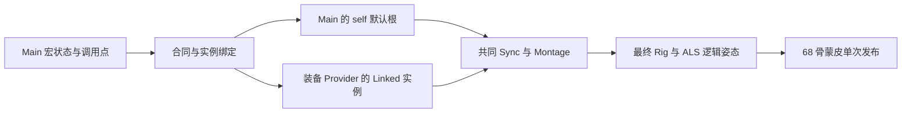

# ALS 人物上的 Lyra Layer：初始 self 与 Main 启动遍历

2026-10-03，直接在主目录实施。本批继续沿用 ALS 人物和骨架、原 Lyra Interface/Layer 合同；按用户要求不展开 UE 5.8/5.9 差异。两种构建的完整矩阵与独立审计已通过，本批关闭初始 self 的真实角色构造路径及指定 Main 启动遍历。完整阶段调度与整个移植目标保持 active。

## 资源与实现选择

继续使用 ALS Mannequin 原模型、材质与蒙皮。真实 `LyraAlsCharacterBinding` 加载原 ALS 网格，校验骨名、父骨和 68 根蒙皮骨；完整 Lyra 姿态统一映射后只发布一次。现有布局为 skin68、raw69、logical81：raw 增加右手下的 `weapon_r`，logical 再保留 11 个原 ALS 虚拟骨及武器空间左手虚拟骨。这些控制通道参与求值，不需要给原模型增加蒙皮权重。

Lyra 动作离线重定向到 ALS 后导出，保留 Distance 曲线、Sync Marker、Notify/NotifyState、additive 基底、RootMotion、Montage 和骨遮罩元数据。沿用 ALS 模型不意味着原 ALS 动作可以直接替换 Lyra 的 Start/Stop/Pivot：替换动作仍须补齐曲线、时序和控制数据。Manny 的骨索引、脊柱遮罩和 Rig 参考长度都要适配目标；动画重定向本身不会替 Rig 完成这些适配。

普通 Blueprint Interface 映射到 C# typed 查询服务或事件消费者。Animation Layer Interface 定义带 Pose 输入/输出的动画函数；输出必须携带骨姿态、曲线、属性和根运动。当前 14 个原编译入口从资源生成，Aiming 保留 Pose 加两个 double 参数，SkeletalControls、LeftHandOverride 各保留一个 Pose 输入。

Main 控制宏状态、调用顺序、共同 Sync、Montage 和最终 Rig；Provider 提供装备相关子图。不可变资源可共享，播放器、状态、缓存和 worker 历史按真实 Linked 实例持有。Layer Group 决定实例共享，Sync Group 决定源选主和时间同步，BlendMask 决定骨权重，三者各自保留。命名组内共享实例，None 按调用点独立；同函数两个调用点不能只用函数名作为实例路由键。该分组原则也见 [Epic Linking 文档](https://dev.epicgames.com/documentation/unreal-engine/animation-blueprint-linking-in-unreal-engine)。

普通执行沿用同一套 C# 图宿主和精确算子。AnimationTree 可承担预览和调试视图；扩展编辑器时应读取同一份合同和节点定义。模型绑定目前关闭其他 AnimationMixer，并拒绝额外 SkeletonModifier 写入，确保最终发布只有一个 writer。Godot 对 Mixer/Modifier 的处理顺序见 [官方设计说明](https://godotengine.org/article/design-of-the-skeleton-modifier-3d/)。

## 本批接入

`LyraSceneCharacter`、`LyraCharacterAnimation`、`LyraMainPoseHost` 增加 `linkInitially=false` 构造路径。默认已有 Provider 路径保持原参数默认值；新路径直接从原 Main self 目标创建绑定，不先分配 Linked 实例再解绑，命名通知也不创建临时 Linked receiver。人物、装备对象、Main、物理 Montage bank 和最终 Rig 仍是真实角色对象。

新增 `LyraMainSelfGraphPhases`，从导出的 Main 编译节点和边读取启动拓扑，执行 Initialize、第一次 CacheBones、同 counter 的重复 CacheBones。真实 Main 状态机进入 Idle，时间为零、12 个状态权重为 `[1,0,...,0]`；实际 Main 惯性历史重置，姿态缓存清理。原 Idle 之外的 Main Lean12/16/22 不在启动时提前访问。三个阶段不推进 source、不发布角色物理帧。

Layer 调用继续使用已有实际调用点路由：Initialize/CacheBones 访问选中根后访问全部输入，LinkedInputPose 只同步计数；Update/Evaluate 则沿选中根访问。原 self SkeletalControls 空根在 Update/Evaluate 停止其上游 Main 图，不妨碍初始化输入，也不妨碍外部最终 Rig。共享 SaveCachedPose 的启动生命周期复用 Core 计数门禁，重复 CacheBones 在共享缓存处停止，不能每个 reader 重走子图。

启动阶段控制器只在构造期保存三次遍历的缓存历史，构造完成后留下不可变结果。它尚不是贯穿角色整个生命周期的通用阶段调度器；后续重新初始化、动态 RequiredBones/LOD 和全部 Provider 的完整阶段仍待实现。当前固定骨映射来自已有构造绑定，Rig VM Construction 保持原首次求值的 pending 路径；本批不声称已实现或验证完整 Rig CacheBones/Construction 阶段。

## 独立 UE 参考

新可选采集插件在临时世界内执行原 `ABP_Mannequin_Base` 完整 Root85 的 Initialize 和 CacheBones，使用原 Manny 164 骨布局、零 Linked 实例。组件注册后显式调用原 Proxy 的 InitializeRoot，再递增原 CacheBones counter 并执行两次缓存；这是受控原阶段参考，不是整个 UE 世界自然启动调度的采集。Tap 转发原节点调用，读取实际状态机状态和权重；恢复所有临时实例链接后销毁世界，不保存原资产。

两次独立 UE 进程均退出0、无 Error/Fatal/Ensure，各20条原加载或 GameplayTag Warning 保留，request/native/closure 逐字相同。Initialize 与首次 CacheBones 各观察30项，重复同 counter CacheBones 观察15项；包括真实 self 根、缓存、状态机 Idle，未访问三个 Main Lean 根。

状态机 Initialize 会重建非反射的 `StatePoseLinks`，采集 Tap 无法单独观察 StateResult8 本身。Godot 只从对照中去掉这一项，同时检查其实际子节点9、机器状态及全部权重；其余观察项顺序精确一致。该限制不代表所有编译节点都有独立原生访问证据。

原生阶段采集没有 Evaluate、没有新增默认最终姿态参考。它证明原 Main 启动拓扑与上述时序；不能用 Manny164 启动结果宣称 ALS81 默认最终骨姿态已完成新的连续原生验收。

九份原 UE 源码逐字副本及 SHA ledger 保留，包括 LinkedAnimGraph/Layer、LinkedInputPose、SaveCachedPose、StateMachine、LayeredBoneBlend、AnimNodeBase、Proxy。本批只在仓库内增加可选采集源码；临时构建插件已移回 artifacts，原工程源码与配置未修改。

## 验证与收尾

Debug 和实际 ExportRelease Optimize 构建均0警告0错误。Core LinkedLayer 131 项通过；它们覆盖既有合同、路由和阶段 API，新 Main 启动接入另由真实 Godot 角色验证，不将131项全描述为本批新增 Main 测试。

运行矩阵包含每构建六个 initial self 用例、六个旧 Unlink 用例、默认根/路由/命名通知/武器/实时通知、普通十角色/Emote，以及四布局外部完整 Main 最终 Rig，共23个 Godot 进程。初始用例每组三种 Provider、六角色，执行初始 self→首次 Link→Unlink→reLink，检查取消重试、空源共同 Sync、Montage、模型发布和最终 Rig。空中覆盖来自明确抬高2米后的真实 Jolt 下落，不称为自然 Jump 等价验收。

最终 Debug/实际 Optimize 各23个、共46个 Godot 进程全部退出0且无 ERROR/WARNING；两构建计数精确相同：

| 每构建范围 | 角色提交 | 默认帧 | 取消重试 | 绑定切换 | 扰动后下落默认帧 |
| --- | ---: | ---: | ---: | ---: | ---: |
| 六个 initial self 用例 | 14,040 | 7,020 | 7,020 | 180 | 2,340 |
| 六个旧 Unlink 用例 | 14,040 | 4,680 | 7,020 | 144 | 744 |

所有初始 self 默认帧完成最终 Rig、实际姿态发生改变。旧 Unlink 全部计数与前批精确相同。四布局外部 Main 最终边界每构建4,320帧/同数retry，仍使用既有独立原生参考；单组/逐调用点保留34/47字段范围，另外两命名布局保留对应32/47范围。普通十角色与 Emote 完整 JSON 在两构建之间、以及与前批冻结报告之间精确相同。

`tools/verify_lyra_initial_self.py` 的最终独立审计通过，记录 `artifacts/lyra-analysis/initial-self-v1-integrity.json`：18份本批源码冻结与其余受控源码保持，870份 Lyra JSON、710个原包、9项原项目/配置与九份原 UE 源副本保持。三个 Optimize 验证阶段各六个 Debug 程序集/符号逐字恢复；实测 Optimize 的 GodotALS 程序集与 Debug 不同。

完整证据包括 `main-phases-v3[-repeat]-{requests,native,closure}.json`、`main-phases-v3-build-{debug,optimize}.log`、`initial-self-v1-core.trx`、`initial-self-v1-{debug,optimize}-verification.json` 及两类完整 Main 报告。首轮资源预审和最终审计分别保留在 `initial-self-v1-preflight-final.log` 与 `initial-self-v1-audit.log`，不以预审替代运行矩阵。

## 失败记录与剩余范围

- 首次 native 采集的 LayeredBoneBlend 源文件目录写错，未写出成功闭包，日志保留。
- 第二次采集把 `FPoseLink.LinkID` 当成编译节点编号，实际它是属性索引，导致 tap 错位和 state=-1。修正为 `Properties.Num()-1-LinkID` 后原图访问与状态正确，两次独立采集一致；没有改原动画算法。
- 新审计脚本首轮将重复 CacheBones 的观察数误写为16，实际为15；已按保存的原记录修正，只修审计预期。

本批仅关闭初始 self 的真实角色路径与指定 Main 启动阶段。通用 Provider 完整 Initialize/CacheBones、后续图重新初始化、RequiredBones/LOD、Rig Construction 时序、self scalar 与部分绑定、新 ALS 默认最终姿态原生参考继续开放。当前 private 字段34/47、UE/Jolt同输入物理314/1680差异、其他 Provider/图、近景握持、复杂地形、材质与性能仍为后续验收；音频、道具物理、头颈暂缓保持。

没有新增 GPU 观感、全量 managed、十分钟或性能验收；没有提交或推送。用户未提交修改、ignored 资产及全部 JSON 字节级依赖保留。
