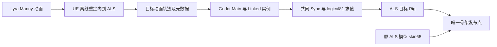

# Lyra 长待机、双向转身与 Linked 左手设置

2026-10-03，继续 ALS 人物和 Animation Interface / Layer 路线。本批增加真实设置入口和原生变化轨迹；整个 Lyra 移植目标保持开放。

## 资源与实现决定

继续复用原 ALS Mannequin 网格、材质和 68 根蒙皮骨。动画采用 69 raw / 81 logical 布局，包含 `weapon_r`、原 ALS 虚拟骨和武器空间左手虚拟骨；最终由 `LyraAlsCharacterBinding` 按骨名和父骨验证后写入 68 根蒙皮骨。Lyra 动画离线重定向到 ALS，遮罩、辅助骨和最终 Rig 使用目标骨架布局及参考姿态。资源和曲线/Marker/Notify/Montage/additive/属性/root 元数据需一起准备，不能只复制 FBX。

普通 Blueprint Interface 映射为 typed 角色服务。Animation Layer Interface 继续采用生成合同、带完整姿态通道的调用和实际 Linked 实例。Main、Layer Group、Sync Group、BlendMask 分别承担主图历史、实例归属、源同步和骨权重；每个实际实例拥有自己的图状态。当前 Lyra 十四入口可执行 single、three-groups、mixed、per-call 四种布局，分别分配 1/3/4/14 实例。通用绑定决策的 self/default/Unlink 已有参考，任意这些布局的完整图执行仍是独立待办。

`LyraCharacterAnimation.SetLeftHandPoseOverrideEnabled(bool)` 是新增普通角色入口。调用需要活角色、Godot 主线程，以及没有移动/动画候选执行中的物理帧边界；本批普通入口在 Move 前调用。Main 先验证所有实际 Linked 实例，再写入各自的 `EnableLeftHandPoseOverride`，拒绝外部 owner、退役实例及 pending 帧的设置变更。

设置属于外部玩法输入；取消动画候选保留已经写入的输入。左手权重仍由原图回调读取此实例的设置及上一提交曲线计算，随动画候选提交/取消。同类重绑保留设置；换类创建新实例并读取原 CDO 默认值。设置不借用 native 私有字段作为输入。

当前三 Provider 原 CDO 的 `LeftHandPose_Override` 均为空。打开布尔开关沿原 null SequenceEvaluator 的 reference pose 分支执行。本批不提供非空左手 Sequence 绑定，不代表完整武器握持已验收。

## 原生轨迹

`capture_lyra_linked_idle_turn.py` 仅在内存中插入作者输入生成步骤，原 `capture_lyra_whole_main.py` 和原 C++ 探针保持字节哈希。使用已构建的原多实例探针，六轨迹为三 Provider × single/per-call，每轨迹 30Hz、24 秒、720 帧。

观察输入保持静止站立，分别在 8、13、18 秒改变 actor yaw；短时开火中断待机。左手开关在 3–4.5、10–12、19–22 秒开启，每 37 帧中一次同类 relink。原图、源时钟、状态规则、数值门槛和参考输出均未替换。

成功原生进程退出0，提取4320帧，保存资产0。六轨迹的 RotationDirection 和 RecoveryDirection 均包含 -1/+1；TurnAnimTime 实际推进，LeftHandWeight 在0/1间变化。Unarmed/Rifle 的 IdleBreakIndex 从0到1；Pistol 原资源只有一项 IdleBreak，索引维持0是原行为。

第一次采集 V1 已保留：提取成功后变化覆盖断言错误地要求 Pistol 索引变化；其180°输入跳转也未覆盖两个方向。V2 根据原资源数量检查索引，并用90°步进覆盖双向。没有调整图算法或原比较门槛。早期 Debug 编译引用错误已修复，其日志也保留。

## 已完成的验证

冻结37份源码后，Debug 和实际 ExportRelease 构建均零错误、零警告。最终30个 Godot 进程终态退出0，无 Godot ERROR/WARNING；每配置15进程：

| 检查 | 每配置进程数 | 范围 |
| --- | ---: | --- |
| 新长待机/转身/左手设置参考 | 4 | single/per-call，各 pre-rig 与最终 Rig |
| 原作者输入回归 | 4 | 四布局，pre-rig |
| 原三频回归 | 3 | 30/60/120Hz，十四独立实例，pre-rig |
| 原普通十角色 | 1 | 60Hz、十四独立实例，默认设置 |
| 新普通十角色设置 | 3 | 30/60/120Hz、十四独立实例，开关/换类/同类/取消重试 |

两配置原生矩阵合计41040提交帧及同数取消重试；十二图字段23328000次比较，新增 Enable 布尔字段1944000次比较，拒绝82080次 pending 配置修改。旧八 worker、三预更新、九移动字段及完整姿态/曲线/属性/root 原门禁同时执行。新参考直接检查五项变化，与此前七项变化合并后，十二图字段均具备真实变化证据；Pistol 单项 IdleBreak 索引0仍按原资源判断。

普通设置检查合计33600角色帧，开启/关闭权重各16800帧，玩家3360次取消重试；拒绝执行中修改3360次、退役实例修改504次，每实际实例还检查外部 owner 修改拒绝。同类复用设置及换类原默认初始化通过。两个配置在各频率的完整报告逐项相同；默认十角色报告也与前批相同。

`tools/verify_lyra_linked_idle_turn.py` 独立核验捕获成功/0保存、原始六分片及作者输入、实际字段变化、终态日志/比较次数、冻结源码与实际程序集、六轮六文件 Debug 恢复。869份既有资源 JSON、710个原 UE 包和9项项目配置的字节哈希保持。结果为 `artifacts/lyra-analysis/linked-idle-turn-v2-integrity.json`，`auditPassed=true`；没有放宽原精度门槛。

本批没有资源重导、GPU/近景、managed全量、十分钟、性能或独立游戏导出测试。新长轨迹只有30Hz；另外两频为既有参考回归和新普通设置用例，不能当作新长轨迹的三频原生采集。

## 仍开放的边界

新增设置使捕获私有字段的明确检查范围从32扩大至33/47。其余十四字段包括另外七项装备/图配置、RootMotionMode及六项引擎标志，仍不宣称完整私有状态对齐。`bQueueMontageEvents` 必须按各实际实例的 Montage 推进与 dispatch 生命周期实现，不能复制 Main 的值。

非空左手 Sequence、更多 Provider / 任意图拓扑、同函数多调用节点、default/self/Unlink/部分覆盖整图及共享/持久 Linked 子系统继续开放。完整 Chaos/Jolt 同输入运动原有314/1680帧差异未由本批复测或关闭；复杂地形、近景握持、GPU专项、跨平台、独立导出和性能也未在本批验收。音频、道具物理和头颈专项仍按原要求暂缓。
