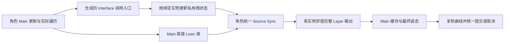

# 多组 Animation Layer 的原生整图参考

2026-10-03，继续 ALS 人物及 Lyra Interface/Layer 路线。上一批完成普通实例归属与生成合同；本批取得多个真实 Linked 实例执行原 Main 的连续姿态、字段和时钟参考，作为后续 Godot 多实例执行器的依据。

## 原图及实例归属

`LyraWholeMainOracleLibrary::ReadTrace` 接受受控 `functionGroups` 配置，只在进程内调整原编译函数的 Group，结束后恢复原函数表。保留原函数签名、图根、更新函数、状态机、源、缓存、惯性、同步和最终 ControlRig；没有编译新 AnimBP 或保存原包。

调用实际 `LinkAnimClassLayers` 后，按每个 Main 调用节点的 `GetTargetInstance` 取得目标，使用真实 `GetLinkedAnimInstances` 顺序更新实例。每个图根的 tap 位于实际目标实例，仅观察原图，不提供替代姿态或时钟。多个实例均参与原 Main 的一次同步和完整根求值；求值后向各实例复制 Main 曲线。

三种 Provider 为 Unarmed、Pistol、Rifle。每种执行以下四个布局，均使用现有 ALS 81 logical 骨参考、原目标骨 mask 和瞬态重定向资源；已有 68 skin/69 raw/81 logical 交付资源保持。

| 布局 | 配置 | 实际实例数 |
| --- | --- | --- |
| single | 十四入口均为 ItemAnimLayers | 1 |
| three-groups | 十个移动入口为 Body；Aiming/Additives 为 Aim；Skeletal/LeftHand 为 Controls | 3 |
| mixed | Body 与 Controls 同上；Aiming/Additives 各为 None | 4 |
| per-call | 十四入口均为 None | 14 |

记录每个调用点的函数、Group 和实际目标，以及每个实例更新前、更新后、求值后的字段与全部 SequencePlayer/Evaluator 时钟。每 37 帧的第 19 帧调用真实同类 Link，检查实际实例指针顺序及完整字段/时钟不变。

## 已验证范围

30/60/120 Hz、每轨迹 12 秒的 36 条完整原生轨迹已通过独立检查，共 30240 帧、816 次同类 Link。站立、移动、蹲姿、起跳和下落均覆盖，十四个真实入口均有正权重执行。多实例布局逐帧存在不同字段和播放器状态，而同一 Provider 四布局的完整输出在本轨迹逐值相同，最大位置差 0。它证明本轨迹需要实例状态隔离，也为输出回归提供参考；不能据此合并状态或推断其他布局/动作也相同。

原完整 Editor 构建成功，保留现有 UE 弃用警告。首轮捕获退出 0，无原生 ERROR/Ensure；加载和瞬态动画依赖等 3135 条 Warning 保留。869 份旧 JSON、710 个原 UE 包和 9 项项目/Config 文件经独立哈希校验保持。新参考仅存于 ignored `artifacts/lyra-analysis`，不替换已有验收资产。

60 Hz 首轮标签为 `multi-layer-v1-60-full`，最终独立检查为 `multi-layer-v3-60-baseline-audit-integrity.json`。30/120 Hz 标签分别为 `multi-layer-v3-30-full`、`multi-layer-v3-120-full`，最终共同检查为 `multi-layer-v3-frequency-audit-integrity.json`。后续多实例捕获按完整轨迹保存十二个 native 文件及带 SHA256 的清单；不在轨迹中途拆分或重建状态，以减少连续捕获和复验的内存占用。

独立原生进程 `multi-layer-v3-60-repeat-full` 的十二条完整轨迹及请求与首轮逐字哈希相同，包含每个实例的全部记录字段/播放器、原更新访问、完整 Layer/诊断输出、Main 姿态/曲线/属性/root；仅新清单中的文件名含新标签。重复轮独立检查为 `multi-layer-v3-repeat-audit-integrity.json`。

最终 `tools/verify_lyra_multi_layer_closure.py` 检查四轮数据及当前文件哈希、三个独立检查报告与 verifier 源版本、实例数/十四正权重入口/连续覆盖/私有状态、原项目和资源保护以及重复轨迹。`multi-layer-v3-final-integrity.json` 通过：共 48 条完整原生轨迹、38880 帧、1044 次同类 Link；四个成功 UE 进程均退出 0，无 ERROR/Ensure，各 3135 条原加载/依赖 Warning 保留。旧 869 JSON、710 个原包和 9 个项目/Config 文件保持。它关闭本批受控多组整图参考与独立重复，不关闭 Godot 多组执行或整个移植目标。

分文件保存首轮 `multi-layer-v2-30-full` 在最后日志统计处发生 `KeyError: frames`，没有成功进程/marker，不能计为通过。该轮全部文件和日志保留；统计已改为读取经过逐帧长度校验的请求。独立 verifier 首次错误把 Main/Aim 诊断 tap 当成接口函数，已按原探针明确列举诊断入口，并分别记录真实函数访问与实际正权重访问。

## 对 Godot 执行器的约束

现有 `LyraMainLocomotionHost`、`LyraItemLayerGraphInstance` 和 `LyraLocomotionSourceScope` 仍执行十四入口单共享实例，本批没有将普通 Demo 切到多组，也没有新增 Godot 图执行验收。

下一步须把 Main 的 macro、直接 Lean、缓存、Montage 和最终姿态事务从 Linked source scope 的归属中抽出，保持角色唯一所有者。绑定结果中的每个实际实例各自保存图字段、状态机、播放器、缓存和曲线反馈，调用点只路由到该实例；None 按调用点独立，命名 Group 按同类同组共享。

本机 UE 5.8 `AnimInstance.cpp:4429` 的 `GetLinkedAnimLayerInstanceByClass` 按原 Linked 节点属性顺序返回首个匹配目标。多实例执行器也须保留这个查询顺序；本批 per-call 首个目标属于 FallLoop，不能用现有 Cycle 实例引用代替按类查询。

2026-10-03 后续源码/快照复核纠正：原路径对全部实际 Linked 实例调用 `UpdateAnimation`，但 ForceParallelUpdate 会将线程安全更新留到实际 Linked 根的 `UpdateAnimation_WithRoot`。UE `AnimInstanceProxy.cpp:1336` 的 FrameCounter 门禁让每个被访问实例只执行一次 worker 更新；未访问实例的 worker 字段保留历史。原十四 per-call 快照中的 Idle/Aim/Pivot 权重及 TimeFalling 差异支持这个边界。游戏线程预更新、worker 更新和图节点访问必须分别处理，不能由“调用了 UpdateAnimation”推出所有通用字段已刷新。上一版本此处的隐藏字段刷新描述不准确。

各 owner 按原调用遍历顺序登记源，保留 owner/node/epoch 身份，并参加一次角色 Sync。同名 Sync Group 跨图共同选主，不给 owner 添加组名前缀，也不重复推进 Main Lean 或 Main macro。求值后按原路径返回完整 Pose/曲线/属性/root，并复制 Main 曲线给每个 Linked 实例；取消/重试和统一提交覆盖全部 owner。新所有者应使用本批原生字段、时钟和三个姿态边界做逐帧对照。



该参考批时此图是待接生产的职责划分，普通 Main 使用原唯一共享实例路径。其后已接真实多实例路由、共同源 Sync 和完整姿态返回，最新范围见 [多实例运行实现](2026-10-03-lyra-multi-owner-runtime.md)；全部实例 worker 字段仍需完成，不能把该参考批的状态描述当作当前完整实现。

同类 Link 保留状态已取得整图参考；不同类替换、部分实现、默认/self、Unlink 的整图输出仍需后续参考，不能以此前仅实例归属的矩阵替代。共享持久实例子系统、复杂参数、完整继承、任意导出闭包和其他 Provider 全图仍开放。

完整 UE/Jolt 物理仍有既有 314/1680 帧差异，本批使用受控物理观察，不关闭该门槛。没有本批 GPU/近景/复杂地形、全量 managed、十分钟、性能或跨平台/独立导出验收；音频、道具物理及头颈继续按原要求暂缓。整个移植目标保持 active。

## 复跑

```powershell
& scripts/capture-lyra-whole-main.ps1 -RunTag <新标签> -PackageName package-multi-layer-v1 -Hz 60 -Case multi-layer -FrameLimit 720
# 30 Hz 使用 360 帧，120 Hz 使用 1440 帧，均为完整十二秒。
python tools/verify_lyra_multi_layer_native.py --tags <新标签> --output <新审计标签>
# 本批最终封口（需换新输出标签，已有成功文件不覆盖）：
python tools/verify_lyra_multi_layer_closure.py --baseline multi-layer-v3-60-baseline-audit --matrix multi-layer-v3-frequency-audit multi-layer-v3-repeat-audit --output <新封口标签>
```

脚本使用独占新文件和包源码哈希门禁，保留所有失败；每轮结束还检查旧 JSON、原包与项目配置。独立 verifier 检查实际实例归属、原函数与正权重访问、字段/播放器完整性、有限数值、81 骨完整输出、同类 Link 状态、运行退出及保护文件，并明确将 Godot 多 owner 姿态等价和整体完成标为 false。
