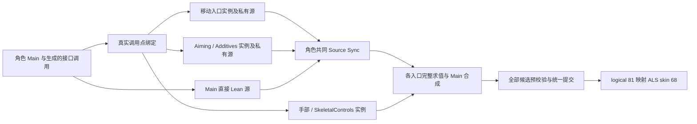

# Lyra 多实例 Layer 路由与共同源批次

2026-10-03，接续角色 Main 状态归属拆分，将原十四入口的实际绑定结果接到图宿主。当前工作仍属于完整移植的中间阶段，实例全部 worker 字段及更广场景的严格对齐保持开放。

## 生产接入

`LyraLinkedLayerGraphSet` 按原 Core 普通绑定策略返回的实例身份创建真实 `LyraItemLayerGraphInstance`，逐调用点记录路由。命名 Group 的入口借用同一对象，None 入口各自拥有对象；实例按原 Main Linked 节点属性顺序登记。按类查询遍历此顺序，首个匹配来自 FallLoop，未固定取 Cycle。

每个实例实际持有自己的完整图宿主、播放器、Warp 历史、Aiming/Additives、手部控制和反馈。Main 的桥接 scope 直接引用各调用点选中的 Start/Cycle/Stop/Pivot/Idle/Air 宿主，保留原遍历顺序；它不复制图历史，也不调用实例未绑定的兄弟函数。Main 直接 Lean 保留角色所有者。所有实际源进入一个候选批次，参加原角色的一次 Sync，同名同步组不添加 owner 前缀。

十四入口的更新、完整 Pose/曲线/属性/root 输出、通知节点查找及外层 Main pose 均通过对应实例执行。实例的 frame scope 绑定同一 Main 候选，错误实例不能调用未绑定入口，源身份包含各自 player 范围与 epoch。最终曲线复制给所有实例，各实例及 source bridge 共同预校验、提交或取消。换类按实际绑定计划创建新实例并退休全部旧实例，退休桥接 scope 也禁止再次 BeginMain；同类调用保留实例。

普通场景可用 `--lyra-layer-layout=single|three-groups|mixed|per-call` 选择同一生产实现；缺省仍使用原 single。元数据修改仅为内存中的不可变合同副本，原 JSON、函数参数、图资产、签名编号和 mask 保留。三组为十移动入口 Body、Aiming/Additives 的 Aim、Skeletal/LeftHand 的 Controls；mixed 把两个 Aim 入口改为 None，形成四个实例；per-call 十四入口各为 None。



图中框表示职责；它们是否共享同一个 Linked 实例，由实际 Group 合同决定。Interface Pose 输入采用生成的类型包装，完整传递骨姿态、曲线、属性及 root，不只传一个动画片段或骨骼数组。

```powershell
& $env:GODOT_EXECUTABLE --path $env:GODOT_ALS_ROOT -- --locomotion=lyra --lyra-profile=rifle --lyra-layer-layout=per-call
```

## 最终验证

当前 v4 Debug/ExportRelease 构建均成功，0 错误、0 警告。早期 v2 三组 30 Hz pre-rig 连续 1080 帧通过，v3 Debug 三 Hz 四布局三边界及普通十一场景通过。v3 原动态换类三个边界失败在 unarmed 第 24 帧：新增完整私有快照错误要求换类后私有历史也保持，已改为该项只检查 Main/Montage/公共同步历史；取消重试与同类 Link 继续检查全部私有历史。v4 修正后的动态换类 30 Hz 三个边界通过。所有早期成功及失败证据独立保留。

最终 v4 两构建 × 三 Hz × 四布局 × 三姿态边界共 72 个进程全部通过，累计 181440 个提交参考帧、4896 次同类 Link，每帧取消重试。逐调用点比较原生实例归属、拒绝其他实例调用、核对按类查询顺序；完整输出沿用原骨姿态、曲线、属性及 root 门槛。候选取消快照扩大到所有实例私有图历史与反馈，同类 Link 后实际对象及状态不变。

缺省/三组/mixed/per-call 普通换层、三种装备三 Hz 与十角色两构建共 88 个进程全部通过（包含各轮原绑定检查）。两构建缺省的 20 份完整普通报告与前批逐项相同；非默认布局各自 Debug/实际 Optimize 的完整报告一致。十角色实际发布各 480 帧 ALS 姿态并移动胶囊，玩家覆盖站蹲、跳跃、ADS、六次换类与六次同类复用；当前头部报告仍明确 `productionAccepted=false`、`nativeWholeMainParity=false`，不作完整物理与移植验收。

原带 Montage 动作/隐藏移动图连续换类参考三 Hz 三姿态边界两构建共 18 个进程通过，保留 Main/Montage/公共同步历史、旧实例及旧候选拒绝；每进程 24 次换类、24 次同类、21 次动作中换类、6 次隐藏换类和 48 次被拒绝换类。独立联合 source scope 两构建各 3780 帧及 Main Idle 反馈回归通过，覆盖专用图实例以外的原构造路径。

最终共 180 个 Godot 进程全部终态退出 0，日志无 Godot ERROR/WARNING。实际 Optimize 使用 ExportRelease 的六个 DLL/PDB，十一轮恢复 Debug 后逐文件 SHA256 相同。独立 `tools/verify_lyra_multi_owner_runtime.py` 审计通过，`artifacts/lyra-analysis/multi-owner-v4-integrity.json` 保存本批源码、运行程序集、日志/报告与所有引用证据哈希：869 份旧 JSON、710 个原 UE 包和 9 项配置不变，原采集源码与已构建 UE 包源码一致，Win64 NativeMath 未变，角色 Main 状态所有者源码同前批。两个最终构建及 verifier 语法检查通过；没有本批 UE 启动、资产重导、GPU、全量 managed、十分钟或性能验收。整个目标保持 active，`fullPrivateFieldParity=false`、`fullPhysicalParity=false`、`goalComplete=false`。

## Worker 更新边界纠正

本机 UE 5.8 `AnimNode_LinkedAnimGraph.cpp:106` 在实际根访问中调用 `Proxy.UpdateAnimation_WithRoot`。`AnimInstanceProxy.cpp:1336` 的 `FrameCounterForUpdate != GFrameCounter` 门禁使每实例 worker 更新仅在该帧首次实际访问触发一次。调用全部实例的游戏线程 `UpdateAnimation`，不代表所有实例都执行线程安全更新。

`tools/inspect_lyra_linked_worker_updates.py` 对已有 30 Hz per-call 原生快照和当前 UE 源码独立核验通过：三 Provider 各 360 帧，9334 个未访问 owner-frame 的四个 worker/图字段保持 Before→Updated 不变，3546 个被访问 owner-frame 有字段改变，非零历史值的具体快照保留于 `multi-owner-v4-worker-boundary.json`。该核验说明此前“隐藏实例通用字段也刷新”的描述不准确，相关旧记录已更正。

后续实现应在每个实际实例中持有通用 worker 状态，把它与具体 Layer 的图状态分开。同一角色帧的首次真实根访问准备一次候选，其余同实例入口借用；未访问实例保留提交历史。Aiming 使用该实例的 HipFire/Aim 权重，移动根读取自己的实例权重，Additives 使用本实例 TimeFalling；输入参数仍在对应根访问时传播，不能以同组首个函数的参数替代其它函数参数。Main 根回调与 Linked worker 的先后顺序需要分别保留，所有候选仍参与角色同一预校验/提交/取消。逐帧核验应覆盖每实例 Before/Updated/After 全部字段，增加实际开火、ADS、隐藏后恢复与不同类替换输入，原数据仅作断言。

当前路由及 source 组合已执行实际私有节点；全部实例 worker 字段、首次访问时读取的 Main 输入与图回调顺序仍需单独完善并逐帧对齐，`fullPrivateFieldParity` 明确为 false。不能仅凭本批完整姿态在原十二秒输入上相同，就把实例字段合并或关闭完整多组等价。后续还需要更完整的 ADS/开火/隐藏恢复及不同类/部分/default/self/Unlink 整链参考。

ALS 人物继续复用 68 skin/69 raw/81 logical。没有本批 UE 启动或资源重导；完整 UE/Jolt 物理此前 314/1680 帧差异、其他 Provider、GPU/近景/复杂地形、全量 managed、十分钟/性能/独立导出及音频/道具物理/头颈暂缓项保持。整个目标保持 active。

## 复跑

成功/失败证据不得覆盖，使用新标签，Godot 进程必须顺序执行。

```powershell
& scripts/verify-lyra-multi-owner-graphs.ps1 -Configuration Debug -RunTag multi-layer-v3-30-full -EvidenceTag <新标签>-30
& scripts/verify-lyra-multi-owner-graphs.ps1 -Configuration Optimize -RunTag multi-layer-v3-30-full -EvidenceTag <新标签>-30
# 60 Hz 使用 multi-layer-v3-60-repeat-full，120 Hz 使用 multi-layer-v3-120-full。
& scripts/verify-lyra-linked-layer-bindings.ps1 -Configuration Debug -EvidenceTag <新标签>-per-call -LayerLayout per-call
python tools/inspect_lyra_linked_worker_updates.py --output <新标签>
# 已生成对应全部证据与 scope 记录后，独立封口（新标签，勿覆盖）：
python tools/verify_lyra_multi_owner_runtime.py --tag <新标签> --include-ordinary-layouts
```

Optimize 使用实际 ExportRelease 六个 DLL/PDB，finally 恢复 Debug 并核对哈希。所有新矩阵结果保存在 ignored artifacts，原导出资产保持字节格式。
