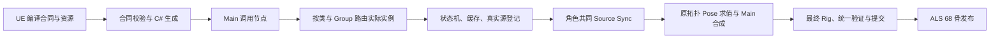

# ALS 人物与 Lyra Interface / Layer 当前复核

最新普通NotifyState已按实际活动库存派发End/Begin/Tick，并修复已提交通知回调内换装：原生13类47回调/双捕获字节同，Core607/最终两构建46进程与178源码/资源/程序集恢复审计通过。见 [实时状态派发验证](2026-10-03-lyra-notify-live-dispatch.md)。ALS68/69/81及typed Interface/Layer路线保持；任意原BP状态行为、世界销毁/弱生命周期、通用整图、完整物理和近景继续开放。下方Begin/Tick待办以本批指定实时库存范围为准。

最新已接普通角色 Montage Ended 前的活动状态收尾，物理实例/直接Montage来源筛选、倒序回调与交换删除经原生11类/31回调及三频适配重试通过。旧窗口经上一程序集复核后保留，新15轨迹/33235帧/45资产/60轨道参考精确通过；最终两构建32进程、Core557及140源码/原资源/程序集恢复审计通过。见 [状态收尾与窗口验证](2026-10-03-lyra-montage-notify-termination.md)。ALS68/69/81和typed Interface/Layer路线保持；完整状态BP/Begin/Tick与世界销毁、通用图及物理/近景继续开放。

最新请求/weight同步回调已接同一候选bank及显式事务化外部效果，ALS68/69/81和typed Interface/Layer路线保持。原生双捕获27轨迹/5670帧相同，最终Debug/实际Optimize共26进程、Core549和108源码/原资源/程序集恢复独立审计通过，见 [同步Montage回调验证](2026-10-03-lyra-montage-immediate-callbacks.md)。下方同步bank待办属于前批范围；任意世界回调、销毁/Section/NotifyState结束、通用图、完整物理与近景验收继续开放，整个目标active。

最新实现已接物理实例捕获委托、指定发布后 bank 回调变更和原 Emote，并通过最终 Debug/实际 Optimize 二十四进程与独立审计，见 [Montage 实例回调验证](2026-10-03-lyra-montage-bank-callbacks.md)。下方关于任意回调尚未实现的描述属于复核时状态；weight/请求阶段同步 bank 变更、销毁及 NotifyState 结束顺序仍开放。ALS68/69/81和当前 Interface/Layer 路线保持，完整目标 active。

2026-10-03。依据当前源代码、本地实际资源、本机 UE 5.8 源码和本轮复跑；按用户要求忽略 5.8/5.9 的小版本差异。本轮完成资源与架构评估，没有修改运行时代码或重新导出 UE 资源。完整移植目标仍保持开放。

## 人物资源决定

继续使用 ALS Mannequin 的网格、材质和原蒙皮骨架。当前 `LyraAlsCharacterBinding` 加载的目标确为 `/Game/AdvancedLocomotionV4/CharacterAssets/MannequinSkeleton/Meshes/Mannequin.Mannequin`；绑定器逐骨检查骨名、父序与导出骨架，并关闭模型内额外 AnimationMixer，完整 Main/Rig 求值后由一个发布点写骨架。

| 布局 | 实际数量 | 用途 |
| --- | ---: | --- |
| skin | 68 | 原 ALS 模型的骨架与蒙皮 |
| raw | 69 | 加入父为 `hand_r` 的 `weapon_r` 动画控制通道 |
| logical | 81 | 再加入原 ALS 11 个虚拟骨和 `VB IK_Hand_L_weaponSpace` |

本轮直接读取 calibration 确认上述数量、父骨和 12 个虚拟骨。源人物为 Lyra `SKM_Manny`，动画经离线重定向到 ALS，再导出目标布局；新增控制通道留在动画运行时，原 68 骨蒙皮继续使用。

ALS 没有 Manny 的 `spine_04/05`。重定向解决动画映射，程序化脊柱补偿、骨遮罩、ControlRig 参考比例、武器挂点和握持空间仍须绑定到 ALS 目标。不能按 Manny 原骨索引套用遮罩，或者删掉找不到的控制骨。虚拟骨在源采样阶段生成并参与后续插值、混合，握持目标不能统一改成最终姿态后的 FK 重建。

资源交付应包含骨骼轨迹、曲线存在性与标志、Distance、Sync Marker、Notify/NotifyState、RootMotion、additive 基底、typed attributes、Montage 槽/轨道和 BlendProfile。普通 FBX 的骨骼动画不能独立提供这些执行数据。当前资源在 ignored 的 `assets/generated/als_v4` 和 `assets/generated/lyra_als`；代码检出需要同时准备资源和依赖哈希。

## 接口、实例与混合的实现

| UE 概念 | Godot 对应 | 当前边界 |
| --- | --- | --- |
| 普通 Blueprint Interface | typed 角色服务、命令和事件消费者 | 状态查询和玩法交互按各原调用移植 |
| Animation Layer Interface | 编译合同、生成参数/Pose 包装 | 原导出 11 类、164 函数；当前生成 14 入口 |
| Animation Layer 函数 | 实际子图的 Prepare/Update/Evaluate | Unarmed/Pistol/Rifle 十四入口均有宿主 |
| Linked 调用节点 | Main 节点、参数、输入 Pose、实例与 epoch | 当前专用图每个函数一个调用点 |
| Layer Group | 按实现类与命名组分配有状态实例 | 1/3/4/14 实例布局已有整图对照 |
| None Group | 每调用节点独立实例 | 同一函数出现多次的通用整图仍待 |
| Sync Group | 实际访问源共同选主、推进与同步 | 所有相关 owner 汇入角色同一 Source Scope |
| Layered Blend / additive | 按目标骨遮罩、混合空间及基底合成 | 与接口函数、实例分组分别保留 |
| 骨架输出 | Main/Rig 后 logical81 → skin68 | 角色统一验证、提交和单一 writer |

例如 `FullBody_Aiming` 的合同是 `PreAimPose` 加 `double AimYaw/AimPitch`，返回完整 Pose 包；`FullBody_SkeletalControls` 和 `LeftHandPose_OverrideState` 各有一个输入 Pose，其余十一入口无输入 Pose。Pose 包携带布局、骨姿态、曲线及存在性、typed attributes 和 RootMotion。输入只读，各宿主拥有自己的输出与候选历史。

大量 Interface/Layer 应继续从元数据生成签名、稳定编号、参数结构和调用包装。共用基础图的装备可共享不可变图定义，并覆盖资源和 CDO 配置；状态机、播放器、缓存、回调及历史属于角色内的实际实例。生成签名以后，Provider 内部每个节点仍需执行支持，不能以 clip 选择函数代替图函数。

当前生成器支持 bool/int32/int64/float/double，保留 Aiming 的 double 精度。不支持的结构、对象等参数要在加载时明确拒绝。推广到任意图时，路由应以稳定的调用节点身份为键；函数名只确定签名，同函数两次调用和 None Group 不能共用一个实例。

同类 Link 保留现有实例历史；换类在帧边界验证候选、初始化新实例并退休旧实例，保留 Main/Montage。普通 self/default/Unlink/部分覆盖的绑定归属已有原生矩阵，当前 `LyraLinkedLayerGraphSet` 仍要求完整绑定到三个支持的 Provider；因此这些分支的完整图执行尚未完成。共享/持久实例子系统也需独立支持。

执行阶段须保留：全部 Linked 实例的游戏线程预更新；Main 当前更新；每实际实例首次根访问的 worker 更新；原图访问、源登记与共同 Sync；依赖顺序 Evaluate；全角色验证、提交及事件派发。隐藏实例仍预更新，未访问的 worker 保留历史。最终 Main 曲线按 UE 组件语义反馈给 Linked 实例。候选失败统一 Cancel，已经完成的物理移动使用凭据重试。

普通实例的本地 Montage bank、是否使用 Main Montage 数据、资源 Notify 与命名 Notify 传播标志应分别消费原配置。已实现四类 Montage 事件容器和原 Emote 消费；任意回调修改 bank、重播/停止/重绑、对象销毁及 NotifyState 结束顺序仍开放。当前立即事件延后到物理成功发布，通用 weight 阶段回调可能改变本帧后续实例遍历，不能直接把现有 Emote 策略推广为任意 UE 回调。需明确候选状态变更与提交后的外部效果，并取得原生时序对照。

AnimationTree 可作为编辑和预览入口。精确的 Linked 实例、距离匹配、缓存、惯性化与属性执行继续沿现有 C# 宿主和算子，骨架保持统一发布。

## 本轮验证

直接运行现有 Debug Godot 4.7.2 .NET 产物，三进程均退出 0、具备成功标记且无 Godot ERROR/WARNING：

| 场景 | 本轮实际结果 |
| --- | --- |
| logical source | 234 源、936 样本、180 additive 样本；69/81/68 布局 |
| linked binding | 14 入口、8 步、4 owner、4 次同类复用、6 种坏合同拒绝 |
| Idle/Recovery resources | 245 源、197 Sequence 绑定、missing=0；475 新样本、960 旧样本 |

三个场景分别验证采样、绑定与资源；最后一项明确输出 `runtime=false`，不能由此扩大到完整地形或视觉验收。另重新执行 `generate-lyra-layer-interface.ps1 -Check`，生成文件与当前原合同一致；Release 的 `AlsAnimationLayerContractTests` 13 通过、0 失败、0 跳过。

日志统一前缀 `artifacts/lyra-analysis/als-interface-current-20261003-`。独立复核当前六个 Debug DLL/PDB 与上一批运行清单哈希相同，70 份冻结源仍相同；审计记录为 `als-interface-current-20261003-audit.json`。本轮没有启动 UE、保存资产、重导资源、修改运行时代码或执行新的完整 Main/物理/渲染验收。

## 后续实施与验收

1. 保持 ALS 目标资源及当前 69/81/68 布局，补近景的 Unarmed/Pistol/Rifle、ADS、左右转身和站蹲握持，检查脊柱补偿与双手漂移。
2. 沿现有合同生成和实例管理器补余下 Linked 配置/引擎字段、非空左手源及 Montage 回调变更时序；明确私有字段原生核验范围目前为 34/47。
3. 把 default/self/Unlink/部分覆盖、同函数多调用点接到通用整图执行，再扩展其它 Provider 和参数类型。
4. 保留完整 UE/Chaos 与 Godot/Jolt 同输入运动的 314/1680 帧既有差异，继续地形、平台和独立导出验收。音频、道具物理与头颈专项保持原暂缓安排。

## 依据

- `LyraAlsCharacterBinding.cs`、`LyraLogicalSourceBank.cs`：模型和三布局实际绑定。
- `AlsAnimationLayerContracts.cs`、`AlsLinkedLayerBindings.cs`：通用合同与普通实例归属。
- `LyraGeneratedLayerContract.g.cs`、`LyraLinkedLayerGraphSet.cs`、`LyraItemLayerGraphInstance.cs`：实际签名、路由和图执行。
- 本机 UE `AnimInstance.cpp:3817`：`PerformLinkedLayerOverlayOperation` 按类/组分桶与 None 逐节点实例。
- 本机 UE `SkeletalMeshComponent.cpp:2114`、`:3295`：Linked→Main 派发和 Main 最终曲线反馈。
- [当前 Montage 事件及开放边界](2026-10-03-lyra-montage-delegates.md)、[接口生成](2026-10-03-lyra-layer-contract-codegen.md)、[多实例整图](2026-10-03-lyra-multi-owner-runtime.md)。
