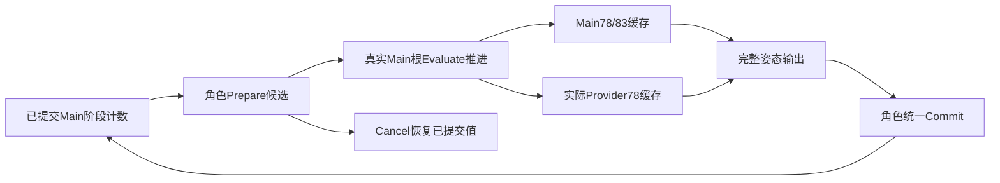

# Lyra Proxy 阶段计数与实际角色求值

沿主目录推进完整 Lyra 移植，继续使用 ALS skin68/raw69/logical81 与原十四入口。本批接入 Main 求值计数的角色候选所有权，并修正运行中换层后的实际 Slot 缓存 owner。完整目标仍 active。

## 原 UE 入口证据

新增独立 `LyraProxyPhaseOracle` 临时插件，使用本机 UE 5.8 的原 `FAnimInstanceProxy` 和 `FAnimNode_LinkedAnimGraph`。三个临时 AnimInstance 中，一份 Main、两份 Linked；前三个调用点分别路由第一实例两个函数和第二实例一个函数。根与 leaf 为受控记录节点，NativeThreadSafeUpdate override 仅记录原 worker gate 是否进入。

探针直接调用原 InitializeRootNode/CacheBones/UpdateAnimation/ParallelEvaluateAnimation 和 Linked SubGraph 入口。设置外部 GFrameCounter 及临时根/目标绑定，不写 Proxy 计数、不复制骨缓存失效门控或 worker gate。原 `RecalcRequiredCurves` 触发真实骨缓存失效；原 ParallelEvaluateAnimation 创建真实求值上下文。

两独立 UE 进程的 requests/native/closure 三文件逐字相同。每次31步、三个Proxy，读取四种计数及对应frame；包含同帧重复根、函数直接调用、隐藏第二实例、空根、重复骨缓存、后续根初始化和 Proxy::Initialize。另通过65536次真实原根求值跨过有符号回绕和-1保留值，检查三个批次端点；这不是每次循环都单独采样的连续全图参考。

原入口确认：

- 非空 Main 根按实际访问推进本阶段 counter；Linked 函数根先同步调用方 counter，函数调用本身不推进目标 counter。
- Main CacheBones 只在原失效门控允许时进入。Linked CacheBonesSubGraph 直接遍历，绕过目标 Proxy 的失效门控。
- 初始化根本身不触发骨缓存失效。Proxy::Initialize 重置 Update，保留其余三个计数；不能用“全部归零”代替。
- Worker gate 按原外部frame控制，原初始FrameCounterForUpdate为0。同帧第二次进入Main根仍推进Update并执行子图，worker不重复。
- 隐藏目标保持原计数和worker历史。空根不推进图计数，但 UpdateAnimation_WithRoot 仍可能执行该 Proxy 的 worker 阶段。

**范围限制：**本探针使用独立记录根和基础临时AnimInstance，不是原 Lyra Blueprint worker/完整 Main 图；外部frame为受控输入，不是自然SkeletalMeshComponent全帧调度，也没有真实LOD切换或资产保存。

## 实现与生产接入

Core新增不可变 `AlsAnimationProxyCounters`，保存Initialization/CachedBones/Update/Evaluation。Main根推进调用既有 `AlsGraphTraversalCounter.Next`；Linked同步只复制当前阶段；Proxy初始化只重置Update。骨缓存失效、实际根身份、worker gate与外部frame仍由真实宿主负责。

普通 `LyraMainPoseHost` 将求值 counter 与借用姿态的视图序号分开。Prepare从已提交值复制候选；真实根Evaluate在缓存源之前推进候选计数；重复根求值继续推进，包含初始self/Unlink的空SkeletalControls根路径。角色Commit后发布候选，Cancel恢复已提交值。update-only不推进Evaluation。

视图序号继续单调递增，跨取消也不回退，因此恢复相同动画counter不会使旧姿态视图重新有效。Main78/83与Provider78收到本次实际Main根计数；SlotComposition和无Montage组合共用它。

发现并修正 `LyraMainPoseHost.Rebind` 新建SlotComposition时漏传CacheOwner。构造和换层都传入实际Main/Provider选择器；选择器在求值时解析当前实例，避免换类后继续借用旧owner或完全遗漏共同历史。

普通MainPose夹具增加实际counter检查：Prepare不发布、首次根推进、同帧重复根推进、取消恢复、重试与clean具有相同首根计数、update-only保持、提交与角色隔离。真实Character初始self/Unlink/reLink夹具增加Main历史保留、取消重试和访问到的三个Slot缓存实际owner检查。

## 验证状态

Core相关170项通过，包括两项直接读取本批原生证据的测试，共比较768个counter/frame标量。Debug与实际ExportRelease Optimize构建0错误0警告。

最终Debug与实际ExportRelease Optimize共62个Godot进程全部通过，无Godot ERROR/WARNING。MainPose和真实反馈各11340帧、Slot合成47610帧、最终Rig7560帧及原阶段、初始self、Unlink/reLink、默认根、武器/通知、普通十角色/Emote通过。四布局每构建4320最终Main帧及同数retry保留原姿态与字段门槛；普通完整报告与前批及Debug/Optimize相同。

独立审计通过15份冻结源码、其余4339条基线、870份资产JSON、710个原UE包、9份宿主配置和7份本机引擎源码。Optimize三轮六程序集备份恢复通过，当前为已验证Debug程序集。原UE两进程加载警告各11条保留，无Error/Fatal/Ensure；最终package-v4/native-v1/runtime-v4。没有保存或重导原资产、修改引擎/原项目源码配置、提交或推送。

## 失败记录

保留package-proxy-phase-v1/v2/v3及日志：局部FLeaf名称歧义、原接口protected访问和NAME_AnimGraph未DLL导出。最终package-v4通过派生访问包装调用原导出方法，层名使用相同FName值，没有修改引擎。

Core首次两项测试中一项通过，一项将空根前的Main Update计数误写为3；原五次Main根访问结果为4。修正夹具断言，保留初次TRX和日志；四阶段原生比较已在初次通过，生产算法没有为此变化。

一次Debug构建从项目目录启动，被仓库global.json固定SDK8.0.100拒绝，未产生构建。已从..调用项目绝对路径完成最终Debug/Optimize构建；失败日志保留。

## 尚未关闭

本批生产接入限于Evaluation的实际owner/候选推进与换层Slot缓存接线。Initialization和CachedBones继续来自已有阶段控制器，生产Update尚未使用本批通用counter primitive；没有完成整个Proxy调度器。

现有物理观察帧继续作为求值counter的外部frame，尚未证明与自然UE全局帧、多个物理tick/渲染帧、URO或共享持久Linked系统等价。原初始计数与骨缓存适配边界仍需从真实角色初始化入口连续采集。

下一步采集真实Main/Linked角色的初始化、绑定与阶段联合轨迹，接生产Update/全局执行frame，再补后续整图重初始化、RequiredBones/LOD和Rig Construction。保留原遍历、真实Source时钟、共同Sync及唯一skin writer。

本机 `UAnimInstance::InitializeAnimation` 先Uninitialize（其中停止并清理Montage），然后执行RequiredBones重算、Proxy初始化、Native/Blueprint初始化回调、根初始化与GroupedLayers初始化。完整角色重初始化需按这一顺序处理；本批的Proxy::Initialize/InitializeRootNode受控用例没有执行这条完整链。`USkeletalMeshComponent::RecalcRequiredBones`还会使Main、全部Linked与PostProcess分别重算骨容器，不能只给当前可见Provider更新骨映射。

非零Aiming原生参数传播、任意重复调用/self scalar/部分绑定、其它Provider、全部Source/Foot/Leg私有状态、字段34/47及多组32/47、新ALS默认完整native、UE/Jolt314/1680物理差异、复杂地形/近景/GPU/全量/十分钟/性能仍开放。音频、道具物理与头颈继续暂缓。
